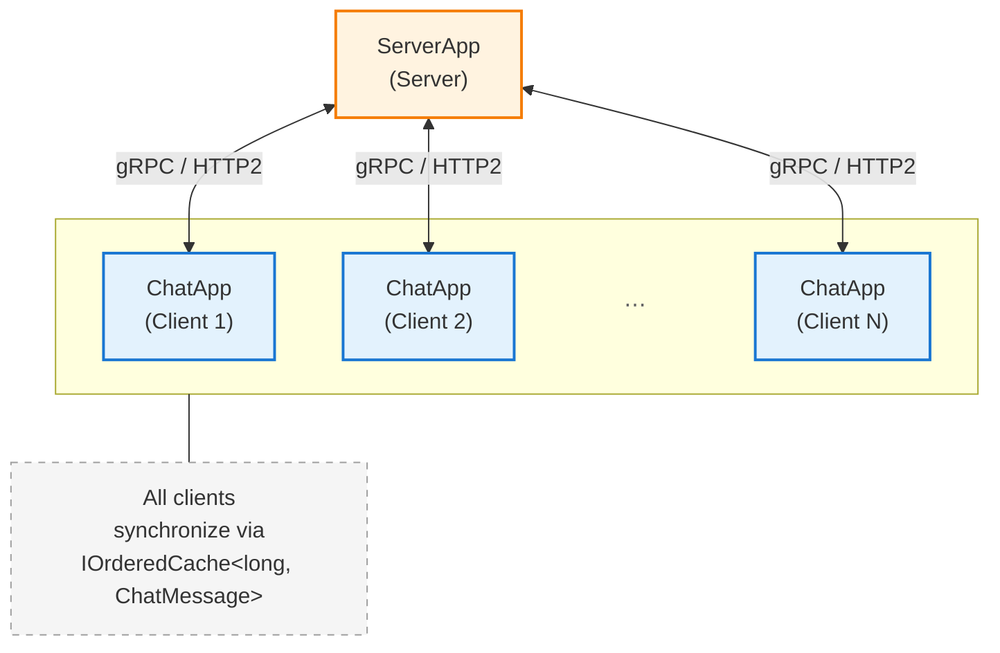

# Baubit Chat - Distributed Caching Sample

Real-time distributed chat application demonstrating Baubit.Caching with gRPC transport. Messages are synchronized across multiple chat clients through a centralized cache server.

## Architecture



**Components:**

- **ServerApp**: gRPC server hosting an in-memory `IOrderedCache<long, byte[]>` exposed via gRPC endpoints
- **ChatApp**: Console chat client using gRPC client to connect to the distributed cache
- **gRPC**: Shared library containing proto definitions, client/server modules, and MessagePack serialization

## Quick Start

### Terminal 1 - Start Server

```bash
cd Samples/ServerApp
dotnet run
```

Server starts on `http://localhost:49971` with HTTP/2 support.

### Terminal 2 - First Chat Client

```bash
cd Samples/ChatApp
dotnet run
```

Enter a username (e.g., "Alice") and start chatting.

### Terminal 3 - Second Chat Client

```bash
cd Samples/ChatApp
dotnet run
```

Enter a different username (e.g., "Bob") and start chatting.

Messages sent by one client appear in real-time on all other connected clients.

## Features

- **Real-time messaging**: Messages appear instantly across all connected clients via gRPC streaming
- **Distributed cache**: Leverages `IOrderedCache<TId, TValue>` for message synchronization
- **Sequential IDs**: Server uses `InMemory.Long.Module<byte[]>` for auto-incrementing message IDs
- **MessagePack serialization**: Efficient binary serialization for gRPC transport
- **HTTP/2 protocol**: gRPC over plain HTTP for development/testing

## How It Works

1. **Server** maintains an in-memory ordered cache storing serialized chat messages
2. **Clients** connect via gRPC and use `IOrderedCache<long, ChatMessage>` interface
3. **Adding messages**: `cache.Add()` sends messages to server via gRPC `Add` RPC
4. **Receiving messages**: `cache.GetFutureAsyncEnumerator()` streams new messages via gRPC `EnumerateFuture` RPC
5. **Synchronization**: All clients receive messages in order through the distributed cache

## Key Code Components

### ChatClient.cs
- `StartListeningAsync()`: Subscribes to future messages via async enumeration
- `RunPostingLoop()`: Reads user input and adds messages to cache
- `DisplayBanner()`: Shows ASCII art banner on startup

### ServerApp/Program.cs
- Configures Kestrel for HTTP/2 over plain HTTP
- Registers gRPC service and in-memory cache module

### gRPC Library
- **Client Module**: Wraps gRPC calls in `IOrderedCache<TId, TValue>` interface
- **Server Service**: Exposes cache operations via gRPC endpoints
- **Serialization**: MessagePack for efficient message encoding

## Configuration

**Server Port**: `49971` (configured in `ServerApp/Program.cs` and `gRPC/Client/DI/Configuration.cs`)

To change the port:
1. Update `ServerApp/Program.cs`: `options.ListenLocalhost(YOUR_PORT, ...)`
2. Update `gRPC/Client/DI/Configuration.cs`: `GrpcChannelAddress = "http://localhost:YOUR_PORT"`

## Technology Stack

- **.NET 9.0**: Console and web applications
- **ASP.NET Core**: gRPC server hosting
- **Grpc.AspNetCore**: gRPC server implementation
- **Grpc.Net.Client**: gRPC client implementation
- **MessagePack**: Binary serialization
- **Baubit.Caching**: Distributed caching abstractions
- **Baubit.DI.Extensions**: Dependency injection modularity

## Troubleshooting

**gRPC connection error**: Ensure server is running on port 49971 with HTTP/2 support enabled.

**Messages not appearing**: Verify both clients are connected to the same server instance.

**Port already in use**: Change the port number in both server and client configurations.
